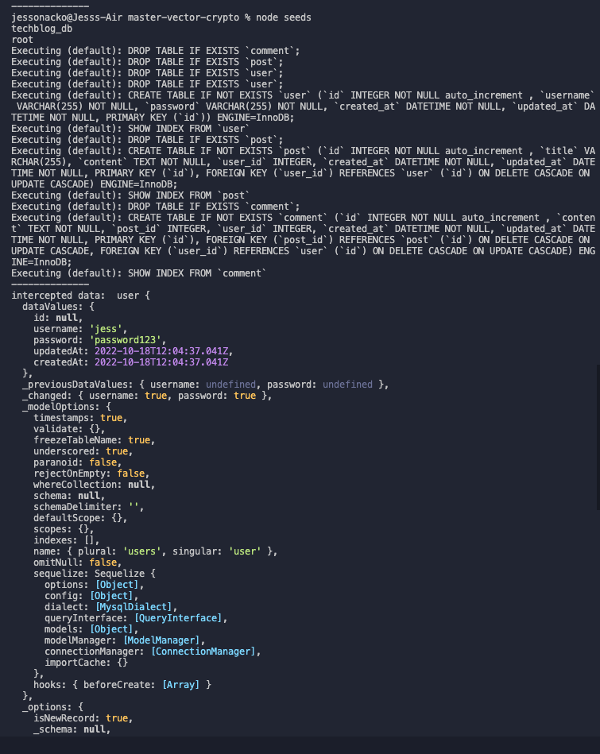
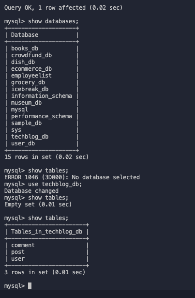
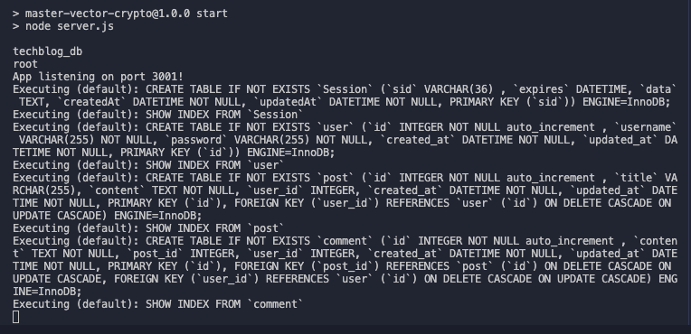
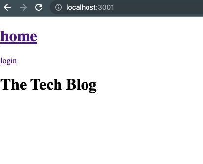
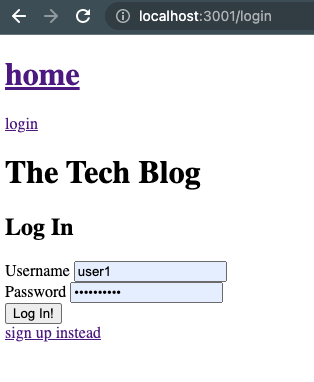
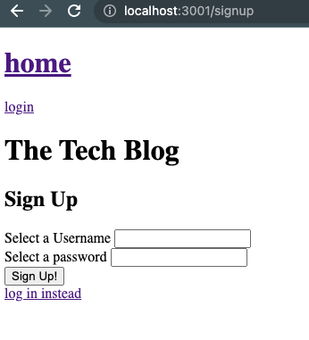
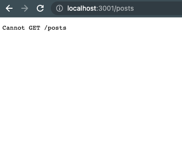

# master-vector-crypto
- Module 14 assignment for UoB Bootcamp due 10-10-22
- Deployed link: https://thawing-refuge-48753.herokuapp.com/ (does not work on link but runs locally - please see section 3 below)

Contents:

1. Summary
2. Key features
3. Issues encountered/further amendments
4. Credits

## 1. Summary

This project was undertaken as a submission for a Birmingham University Bootcamp assignment, with a brief to build a CMS-style blog site similar to a Wordpress site, where developers can publish their blog posts and comment on other developers’ posts as well.  The user story and acceptance criteria are as follows:

User story:

- AS A developer who writes about tech
- I WANT a CMS-style blog site
- SO THAT I can publish articles, blog posts, and my thoughts and opinions

Acceptance criteria:

- GIVEN a CMS-style blog site
- WHEN I visit the site for the first time
- THEN I am presented with the homepage, which includes existing blog posts if any have been posted; navigation links for the homepage and the dashboard; and the option to log in
- WHEN I click on the homepage option
- THEN I am taken to the homepage
- WHEN I click on any other links in the navigation
- THEN I am prompted to either sign up or sign in
- WHEN I choose to sign up
- THEN I am prompted to create a username and password
- WHEN I click on the sign-up button
- THEN my user credentials are saved and I am logged into the site
- WHEN I revisit the site at a later time and choose to sign in
- THEN I am prompted to enter my username and password
- WHEN I am signed in to the site
- THEN I see navigation links for the homepage, the dashboard, and the option to log out
- WHEN I click on the homepage option in the navigation
- THEN I am taken to the homepage and presented with existing blog posts that include the post title and the date created
- WHEN I click on an existing blog post
- THEN I am presented with the post title, contents, post creator’s username, and date created for that post and have the option to leave a comment
- WHEN I enter a comment and click on the submit button while signed in
- THEN the comment is saved and the post is updated to display the comment, the comment creator’s username, and the date created
- WHEN I click on the dashboard option in the navigation
- THEN I am taken to the dashboard and presented with any blog posts I have already created and the option to add a new blog post
- WHEN I click on the button to add a new blog post
- THEN I am prompted to enter both a title and contents for my blog post
- WHEN I click on the button to create a new blog post
- THEN the title and contents of my post are saved and I am taken back to an updated dashboard with my new blog post
- WHEN I click on one of my existing posts in the dashboard
- THEN I am able to delete or update my post and taken back to an updated dashboard
- WHEN I click on the logout option in the navigation
- THEN I am signed out of the site
- WHEN I am idle on the site for more than a set time
- THEN I am able to view comments but I am prompted to log in again before I can add, update, or delete comments

## 2. Key features (please see images to demonstrate the working functionality):

- database is seeded successfully, tables are populated (1)
- server runs locally (2)
- user is presented with the homepage (3)
- when user clicks on the 'home' button, user is taken page to the homepage
- when user clicks on the 'login' button, the user is prompted to login (4)
- when user clicks on the 'signup' button, the user is prompted to sign up (5)

1) 

2) 

3) 

4) 

5) 

## 3. Issues encountered/further amendments

Key issues with the functionality of the app are as follows:

TODO: 

- Post, users and comments routes cannot GET:

- deployed link does not work

- css styling to be added

## 4. Credits

- using handlebars: https://sabe.io/tutorials/getting-started-with-handlebars-js
- help with routing: https://www.youtube.com/watch?v=uip9axsPRDY&t=180s
- routing explained: https://expressjs.com/en/guide/routing.html
